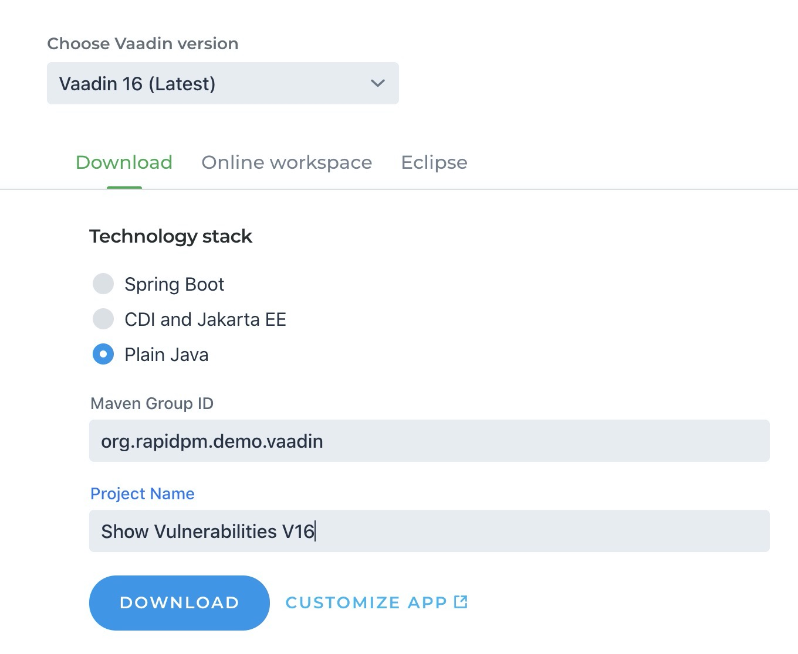

# Find the Vulnerabilities and show how to fix them
In this repo, you will see the result of a security tuning of the default demo app
that is provided by Vaadin for the version V16.0.0 (date 2020-07-03). 
[https://vaadin.com/start/latest](https://vaadin.com/start/latest)
Have in mind, that with every update, this picture will change. (in the good or bad direction, who knows ;-) )

I used the following selection to create the source I used here:


If you want to see how this is done, check out my Youtube channel.

German Version : 
English Version : 

If you have any questions, ping me via email, Twitter or LinkedIn.

If you want to try this one by yourself, start a trial at [https://jfrog.com/platform/free-trial/](https://jfrog.com/platform/free-trial/)
to get access to Artifactory and Xray. 
Check out my Youtube channel to get info, how to ramp up a maven and npm repo.


Have fun, enjoy to scare your manager ;-)
Cheers Sven

btw: If you want to have some other framework checked ...  just let me know. ;-)


------------------------------- orig Readme -------------------------------
 
# Skeleton Starter for Vaadin

This project can be used as a starting point to create your own Vaadin application.
It has the necessary dependencies and files to help you get started.

The best way to use it is via [vaadin.com/start](https://vaadin.com/start) - you can get only the necessary parts and choose the package naming you want to use.
There is also a [getting started tutorial](https://vaadin.com/tutorials/getting-started-with-flow) based on this project.

To access it directly from github, clone the repository and import the project to the IDE of your choice as a Maven project. You need to have Java 8 or 11 installed.

Run using `mvn jetty:run` and open [http://localhost:8080](http://localhost:8080) in the browser.

If you want to run your app locally in the production mode, run `mvn jetty:run -Pproduction`.

### Running Integration Tests

Integration tests are implemented using [Vaadin TestBench](https://vaadin.com/testbench). The tests take a few minutes to run and are therefore included in a separate Maven profile. We recommend running tests with a production build to minimize the chance of development time toolchains affecting test stability. To run the tests using Google Chrome, execute

`mvn verify -Pit,production`

and make sure you have a valid TestBench license installed.

Profile `it` adds the following parameters to run integration tests:
```sh
-Dwebdriver.chrome.driver=path_to_driver
-Dcom.vaadin.testbench.Parameters.runLocally=chrome
```

For a full Vaadin application example, there are more choices available also from [vaadin.com/start](https://vaadin.com/start) page.

